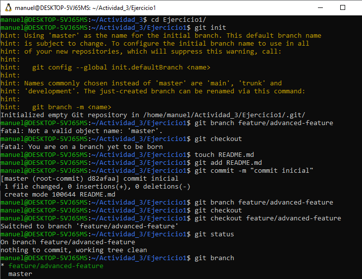
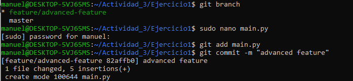
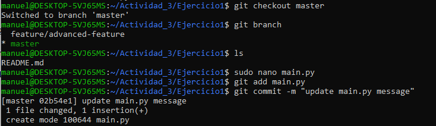
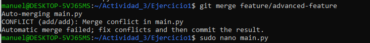
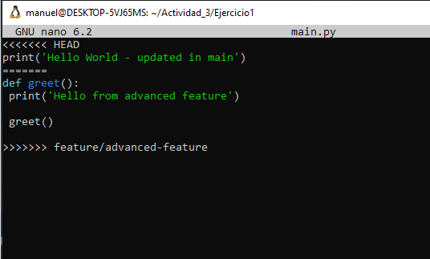
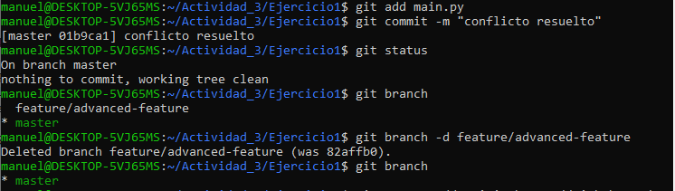

Ejercicio 1: Manejo avanzado de branches y resolución de conflictos

Objetivo: Practicar la creación, fusión y eliminación de ramas, así como la resolución de conflictos
que puedan surgir durante la fusión.

organiza el trabajo.
Al inicio tengo un percance dado que no puedo crear una rama debido a que no existe ninguna linea de trabajo,
para eso inicio con un archivo README y el primer commit para dar paso a la creacion de ramas.

Creamos el archivo en python y confirmamos los cambios en la rama feature/advanced-feature

Realizo cambios en la rama principal con el archivo python tambien.

Fusionamos la rama a la main.

Notamos un conflicto debido a que el archivo en comun main.py en la rama y en la main difieren en su contenido, en 
esta parte se resuelve el conflicto de manera manual , ya que se maneja el criterio de quien maneja el proyecto. En este 
caso manejare ambos y mantendre el contenido de ambos en un solo archivo.

Borramos la rama creada.

